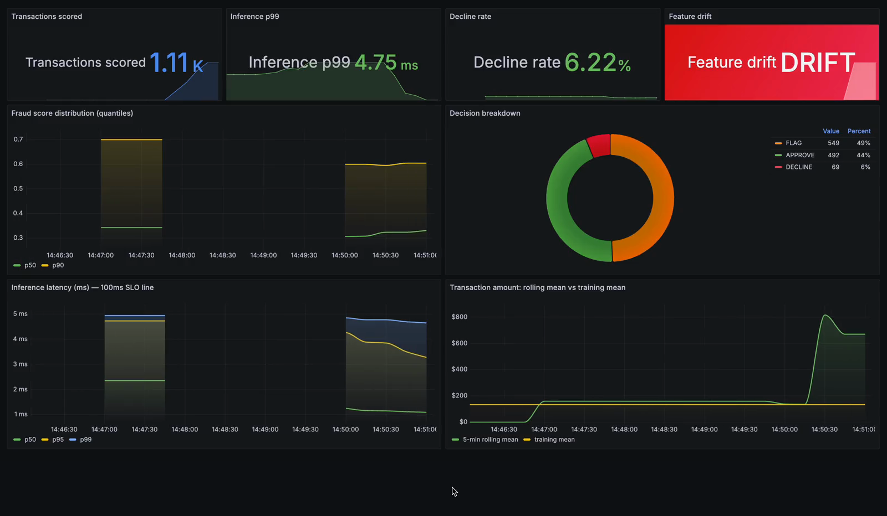

# FraudGraph

Real-time payment fraud detection built on a graph neural network. Transactions from
the IEEE-CIS dataset are modeled as a heterogeneous graph of transactions, cards,
merchants and devices, scored by a hybrid GraphSAGE + attention model, and served
through a Kafka + Redis + FastAPI pipeline. Every decision comes back in about 15ms
with a human-readable reason attached, and a Grafana dashboard watches the live
stream for feature drift.

The point of the project: fraud is relational. One stolen card hits many merchants.
One device fingerprint spans many accounts. A ring of test purchases clusters inside
a five minute window. A tabular model scores each row in isolation and never sees any
of that structure. A graph model does.

## Demo



[demo video](assets/demo.mp4)

What the recording shows, in order: the dashboard under steady traffic (decisions
splitting into approve/flag/decline, latency holding under 5ms server-side), then a
burst of $9,999 transactions gets injected, the 5-minute rolling amount mean tears
away from the training mean in the bottom-right panel, and the drift tile flips from
HEALTHY to DRIFT. That last part is the monitoring system doing its actual job:
catching a distribution shift the moment it happens instead of weeks later in a
loss report.

## Results

Temporal test set (last 20% of the timeline), leakage-free protocol. All model
selection happened on a validation slice carved from the training period; the test
set was scored exactly once per model.

| Model | AUC | Avg Precision | Precision @ 10% recall |
|---|---|---|---|
| XGBoost, 8 hand-built features | 0.769 | 0.139 | 0.250 |
| XGBoost, full ~430 features | 0.907 | 0.524 | 0.946 |
| GraphSAGE (pure) | 0.810 | 0.408 | 0.908 |
| GraphSAGE + GAT hybrid (served) | 0.854 | 0.457 | 0.955 |
| XGBoost + GNN embeddings | 0.872 | 0.502 | 0.964 |

Reading this honestly:

- The hybrid GNN matches the strongest tabular baseline on precision at 10% recall
  (0.955 vs 0.946). That is the metric a fraud operations team actually works with:
  when you investigate the most suspicious slice of traffic, how much of it is
  really fraud.
- XGBoost keeps a global AUC edge. IEEE-CIS ships 339 pre-engineered Vesta features
  that already encode a lot of relational signal, and trees exploit them well. I
  report that rather than tuning around it.
- Feeding the GNN's learned embeddings into XGBoost as extra features did not help
  (0.872 vs the 0.907 control). Under the strict protocol, train-time and serve-time
  embeddings come from different graph views, and the distribution mismatch hurt
  more than the signal helped. Negative result, kept in the notebook.

Serving latency, measured over HTTP with a 100-transaction load test on an M-series
laptop, CPU only:

```
throughput  ~90 req/s
p50         10.5 ms
p95         14.2 ms
p99         15.6 ms
```

The model forward pass itself is 2 to 5ms; the rest is HTTP and feature assembly.
Target was 100ms.

## What went right (and one thing that didn't)

- A controlled ablation validated the architecture. Same graph, same training
  protocol, the learned gate is the only difference: the hybrid beats pure GraphSAGE
  on all three metrics (+0.044 AUC, +0.049 AP, +0.047 P@10R).
- The gate learned something interpretable. On the noisy velocity edges its value
  averages 0.80 (attention). On the dense card edges it sits at 0.37 (mean
  aggregation). On card-history aggregation it varies node by node (std 0.30),
  meaning the model routes per transaction. None of that was hard-coded.
- An audit mid-project found real leakage: early stopping was selecting checkpoints
  on the test set, and training-time message passing could reach test-period nodes
  through reverse edges. Both were fixed (validation split for all selection,
  train-period subgraph for training). The GNN numbers dropped when the leaks
  closed. The table above is the honest version.
- The embedding-stack idea failed under the fixed protocol, as noted above. It had
  worked in the leaky setup, which is exactly why the protocol matters.

## System architecture

```
 offline, Kaggle GPU                        online, local
 -------------------                        -------------

 IEEE-CIS csv files                         transaction payload
        |                                          |
        v                                          |--> POST /score (FastAPI, sync)
 01 EDA + XGBoost baselines  (MLflow)              |
        |                                          v
        v                                   Kafka "transactions" (3 partitions)
 02 hetero graph construction                      |
        |                                          v
        v                                     consumer group
 03 hybrid GNN training + ablation                 |
        |                                    +-----+------+
        v                                    | FraudScorer |
 04 explainer statistics                     +-----+------+
        |                                     |    |     |
        v                                     v    v     v
 artifacts/  ------------------------->    Redis  GNN  explainer
 (weights, embeddings,                   velocity forward  reasons
  entity maps, stats)                         |
                                              v
                                     Kafka "fraud-scores"

                     Prometheus scrapes /metrics every 5s --> Grafana :3000
```

The heavy work (training, graph construction) runs on Kaggle's free T4. The serving
side runs locally: Kafka, Redis, Prometheus and Grafana in Docker Compose, the API
and consumer in a local venv so the dev loop stays fast.

One scoring request, step by step:

1. Payload arrives with the fields a real payment API would carry: amount, product
   code, card id, address, device info, timestamp.
2. Redis records the transaction on that card's timeline and returns rolling counts
   for the last 1h/6h/24h (increment then read, matching how the training features
   were computed).
3. The 437-dimension feature vector is assembled. If the caller supplied a
   materialized vector (feature store scenario), it's used as-is; otherwise the
   known fields are filled and the rest fall back to training medians.
4. The card, merchant and device are looked up in the entity maps. Each one's
   learned embedding is pulled from the model's embedding tables. Unknown entities
   get the mean embedding (cold start).
5. A one-transaction subgraph is assembled and run through the two message-passing
   layers. Sigmoid gives the fraud probability. Under 0.3 approves, over 0.7
   declines, in between flags for review.
6. The explainer attaches the top reasons, metrics are recorded, and the response
   goes back (or gets published to the fraud-scores topic on the streaming path).

Redis schema per card: a sorted set of timestamps for window counts, a hash with
the current velocity numbers and last amount, and a capped list of the last 20
transaction ids. Everything expires after 48 hours.

## Model architecture

The graph, built from 590,540 transactions:

| | count | features |
|---|---|---|
| transaction nodes | 590,540 | 437 (scaled numerics + normalized category codes) |
| card nodes | 13,553 | none, identity via embedding |
| merchant nodes | 527 | none, identity via embedding |
| device nodes | 1,787 | none, identity via embedding |

Edge types (reverse edges added for message passing, 8 total):

- `uses_card`, transaction to card: 590,540 edges
- `at_merchant`, transaction to merchant: 524,834 edges. A merchant is a
  (ProductCD, addr1) pair; rows with no address get no merchant edge rather than
  being lumped into a fake mega-merchant.
- `on_device`, transaction to device: 118,666 edges (identity coverage is ~20%)
- `velocity_cluster`, transaction to transaction: 114,439 edges. Two payments on
  the same card within 5 minutes, directed earlier to later so message flow is
  causal. This edge type targets card-testing bursts and is the piece I added
  myself; transactions inside these clusters run 1.6x the base fraud rate.

The model. Every edge type gets a `HybridGatedConv`: a SAGEConv (mean aggregation)
and a GATv2Conv (4-head attention) run in parallel, and a learned gate blends them
per destination node:

```
gate = sigmoid( W * x_dst / temperature )        # temperature is learned too
out  = gate * GAT(x) + (1 - gate) * SAGE(x)
```

Mean aggregation is the fraud-industry default for good reasons (stable, cheap,
scales), but it treats every neighbor equally, which wastes the sparse velocity
edges where most neighbors are noise. Attention fixes that but is overkill on the
dense, clean card edges. The gate lets the model pick per node instead of me
picking globally, and the ablation plus the learned gate values back that up.

Stack: transaction encoder (437 -> 128), two HeteroConv layers (128 -> 128 -> 64,
sum aggregation across edge types, ReLU), then an MLP head (64 -> 32 -> 1).
Featureless entity nodes carry `nn.Embedding(128)` identity vectors.

Training: focal loss (alpha 0.9, gamma 2.0) for the 3.5% positive class, chosen
over weighted BCE after the pos_weight=27 gradients made validation metrics
oscillate. NeighborLoader with [15, 10] fan-out, batch 512, Adam at 1e-3 with
gradient clipping and ReduceLROnPlateau on validation AP, early stopping after 8
flat evals. The timeline splits 70/10/20: first 70% trains, next 10% validates and
selects everything, last 20% is scored once. During training, message passing is
restricted to the train-period subgraph so no test-period features can reach the
model through reverse edges; at inference the full graph is fair game, same as
production where the serving graph contains all history up to now.

## Explainability

Every response carries graph-grounded reasons, not just a score:

```json
{
  "fraud_score": 0.81,
  "decision": "DECLINE",
  "top_reasons": [
    {"factor": "card-testing burst: 3 tx on this card in the last 5 minutes, 2 confirmed fraud",
     "weight": 0.62, "edge_type": "velocity_cluster"},
    {"factor": "device linked to 15 cards, 5 with prior fraud (3.0x baseline)",
     "weight": 0.28, "edge_type": "on_device"}
  ]
}
```

The reasons come from a deterministic evidence layer over the same graph structure
the model uses: per-card, per-merchant and per-device fraud statistics from the
training period, velocity-cluster membership, and amount outliers. Risky signals
require real lift over the base rate (a card with lots of traffic at the average
fraud rate is volume, not evidence), and protective signals are phrased as
protective instead of being dressed up as risks. Reason generation runs in under a
millisecond, so it ships inline with every score rather than as an offline batch
job. On confirmed test fraud, about 80% of transactions get a substantive reason;
the rest honestly say the model flagged on feature combinations without a single
dominant relational cause.

Fraud labels for the reasons come only from the training-period ledger. A
transaction that happened three minutes ago is an observable fact; its fraud label
is not, because confirmations take weeks. The explainer respects that.

## Monitoring

Five Prometheus metrics, scraped every 5 seconds, visualized in a provisioned
Grafana dashboard (anonymous access, loads on first visit):

- `fraud_score` histogram: score distribution over time
- `decision_total` counter: approve/flag/decline rates
- `inference_latency_seconds` histogram: p50/p95/p99 against a 100ms SLO line
- `transaction_amount_mean`: 5-minute rolling mean of amounts
- `feature_drift_alert`: flips to 1 when the rolling mean moves more than two
  training standard deviations from the training mean

The drift detector is deliberately simple. It is one gauge comparing live traffic
to the training distribution, but it is real: inject a burst of large transactions
and the dashboard goes red within one scrape interval. In production this signal
would trigger a retraining pipeline instead of a color change.

## Repository layout

```
notebooks/
  01_eda_baseline.ipynb          EDA, temporal split, two XGBoost baselines
  02_graph_construction.ipynb    HeteroData graph + velocity_cluster edges
  03_graphsage_train.ipynb       PureSAGE vs Hybrid ablation, embedding export
  04_explainability.ipynb        evidence stats, faithfulness checks
  05_serving_sample.ipynb        exports test transactions with feature vectors
src/
  model.py                       PureSAGE, HybridGatedGNN, focal loss
  features.py                    canonical key/feature semantics shared with serving
  explainer.py                   evidence-based reason generation
  loadtest.py                    latency percentiles + decision breakdown
  serving/
    api.py                       FastAPI: POST /score, /health, /metrics
    consumer.py                  Kafka consumer, scores and republishes
    producer.py                  replays sample transactions into Kafka
    inference.py                 FraudScorer: subgraph assembly + forward pass
    redis_store.py               velocity windows and neighbor lists
    feature_builder.py           payload -> 437-dim vector
    metrics.py                   the five Prometheus metrics
monitoring/
  prometheus.yml                 scrape config
  grafana/                       provisioned datasource + dashboard json
docker-compose.yml               Kafka (KRaft), Redis, Prometheus, Grafana
requirements-serve.txt           serving deps (training deps live on Kaggle)
```

`artifacts/` and `data/` are gitignored; the notebooks produce them.

## Running it

Needs Docker Desktop, Python 3.11+, and the artifacts from the notebooks (see
below).

```bash
python -m venv .venv && source .venv/bin/activate
pip install -r requirements-serve.txt
docker compose up -d
uvicorn src.serving.api:app --port 8000
```

Score a transaction:

```bash
curl -X POST localhost:8000/score -H 'Content-Type: application/json' \
  -d '{"TransactionAmt":59,"ProductCD":"W","card1":7919,"addr1":204,"TransactionDT":8000000,"TransactionID":1}'
```

Load test and streaming path:

```bash
python -m src.loadtest --n 100          # latency percentiles
python -m src.serving.consumer          # terminal A
python -m src.serving.producer --n 100  # terminal B
```

Grafana is at http://localhost:3000, Prometheus at http://localhost:9090.

### Reproducing the artifacts

The training side runs on Kaggle (free GPU, dataset already hosted there). Run the
notebooks in order, downloading each stage's outputs into `artifacts/`, plus
`test_sample_full.csv` into `data/`. Notebook 03 wants a T4; the rest run on CPU.
MLflow runs land in a sqlite file you can browse locally with
`mlflow ui --backend-store-uri sqlite:///artifacts/mlflow.db`.

## Known limitations

- A live payload carries 6 fields; the model was trained on ~430. Without a feature
  store the remainder falls back to training medians, which compresses live scores.
  The entity embeddings still carry the relational signal (a card with fraud
  history scores visibly higher), and the enriched replay in `05_serving_sample`
  shows full discrimination when the vectors are supplied. Building the actual
  feature store was out of scope.
- Single temporal split, not k-fold. Random folds on time-ordered fraud data leak
  the future; walk-forward validation would be the rigorous upgrade.
- The categorical vocabulary was built over the full dataset. It leaks no labels
  and no future behavior (an integer id for "iPhone" carries nothing), but a
  stricter build would freeze it on the training period and map unseen values to
  an unknown bucket.

## If this ran at real scale

- The static graph.pt becomes a graph service (Neptune or a feature-store-backed
  adjacency), growing from the stream instead of being rebuilt in a notebook.
- A feature store closes the 6-vs-430 gap at request time.
- `feature_drift_alert` triggers automated retraining with shadow evaluation
  instead of turning a tile red.
- A blocklist/allowlist pre-filter and a short-TTL score cache sit in front of the
  model, and model versions ship behind an A/B or shadow deployment.

## Stack

Python, PyTorch Geometric, XGBoost, MLflow, FastAPI, Apache Kafka, Redis,
Prometheus, Grafana, Docker Compose. Training on Kaggle T4, serving on CPU.
